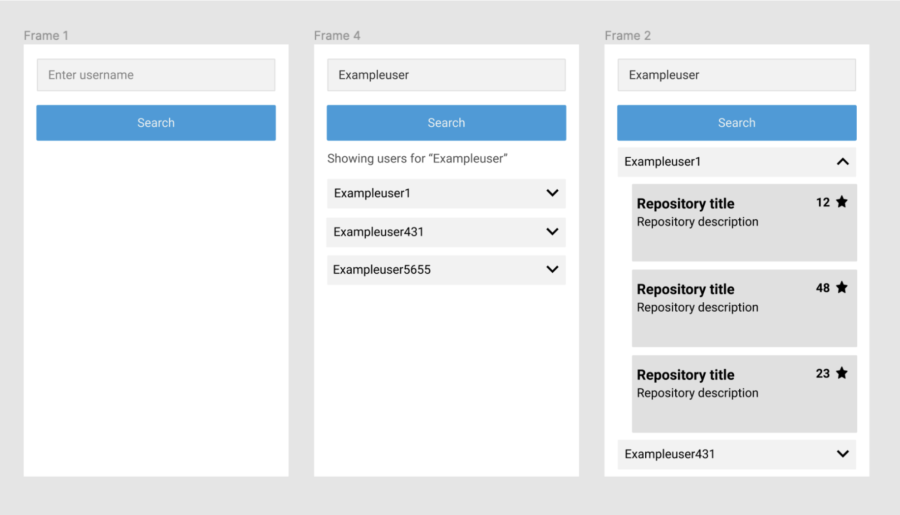

# Recruitment Task

## Project Name: GitHub Repositories Explorer

### Description
Create a React application that integrates with the GitHub API. The application should allow users to search for up to 5 users whose usernames match the input value. Upon selecting a user, their repositories should be displayed (no limit on the number of repositories displayed).

**API Documentation:** [GitHub API v3](https://developer.github.com/v3/)

---

### Designs

---

### Requirements
- Use **React**
- Use **TypeScript**
- You may use other libraries of your choice for forms, styling, testing, state management, etc.
- The app must be available as a **public GitHub repository**
- The app should be **hosted and publicly accessible** (e.g., via GitHub Pages)
- A proper **README** must be provided
- Errors should be handled appropriately
- Good UX practices should be implemented (e.g., keyboard event handling, loading states)
- Only **English** should be used

---

### Nice to Have
- Unit and integration tests

---

### Tips
- Don't forget about **mobile view**
- Use this task as an opportunity to **showcase your best skills**